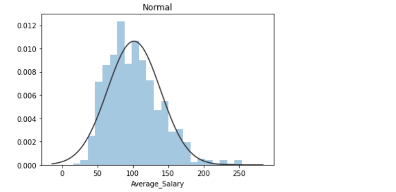
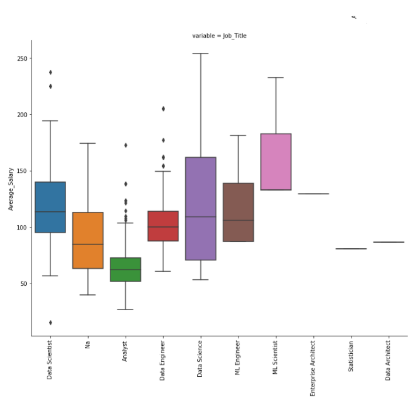
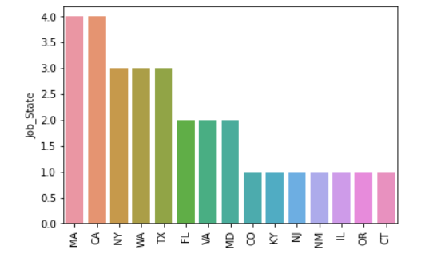
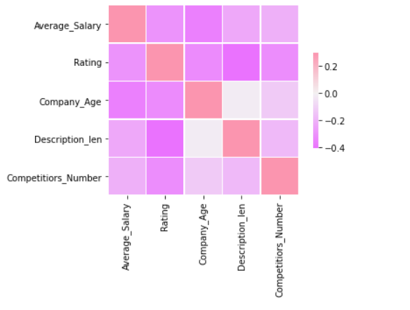

# DataScience_Salary_Project : Overview
* Collected 1000 Data Science job description of glassdoor which is scrapped using selenium.
* Engineered features from the text of each job description to quantify the value companies put on bachelors'degree, python, excel, aws, statistics and spark.
* Optimized Linear, Lasso and Random Forest Regressors using GridsearchCV to reach the best model.
* Created a tool that predict data science salaries worldwide.
# Data Cleaning
* Created new columns minimum, maximum and average salary for a specific job.
* Created new columns for employer-provided salary and hourly wages.
* Removed row without salary information.
* Simplified company name.
* Parsed jobs state and created a new column which consists of states' abbreviation name.
* Perceived age of a company from the company foundation date.
* Created columns for if different skills were required in the job description:
   * Python
   * R
   * Excel
   * AWS
   * Spark
   * Bachelors' Degree
   * Statistics
   * SQL
* Created a new column for description length.
* Removed unnecessary columns.
# Exploratory Data Analysis
I tried analysis the distribution of categorical and numerical values. I also tried to find out the correlation between salaries and other variables.

  
 

# Model Building
First, I transformed catagorical variable to dummies.
Second, I tried three different models:
* Multiple Linear Regression.
* Lasso Regression.
* Random Forest
# Model Perfomance
* **Random Forest :** MAE - 18.69
* **Lasso Regression :** MAE 24.20
* **Multiple Linear Regression:** 122.02

# Resources 
**Python Version:** 3.7  
**Packages:** pandas, numpy, sklearn, matplotlib, seaborn, pickle  
**Scraper Github:** https://github.com/arapfaik/scraping-glassdoor-selenium  
**Article:**
   * https://towardsdatascience.com/selenium-tutorial-scraping-glassdoor-com-in-10-minutes-3d0915c6d905
   * https://towardsdatascience.com/understanding-the-ols-method-for-simple-linear-regression-e0a4e8f692cc
   * https://towardsdatascience.com/data-cleaning-with-python-and-pandas-detecting-missing-values-3e9c6ebcf78b
   
**Guide:** https://www.youtube.com/playlist?list=PL2zq7klxX5ASFejJj80ob9ZAnBHdz5O1t
